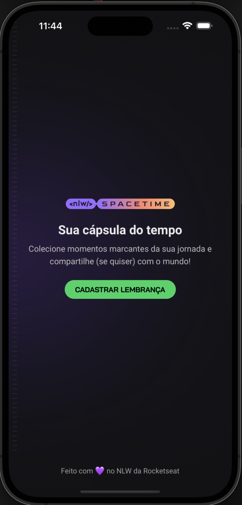
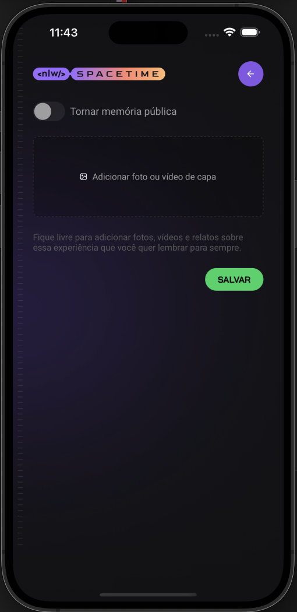
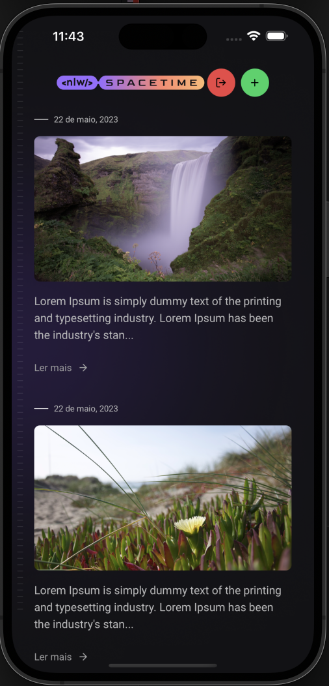

<h1 align="center">
    
</h1>

# NLW Spacetime Mobile

This is the mobile frontend of the NLW Spacetime project. Next Level Week (NLW) is an event organized by @Rocketseat for hands-on teaching on the most up-to-date technologies in the software development market in the javascript universe.
On this project we tested new features and concepts like Next App Router, App Layout, Session Store, OAuth Authentication Protocol

## Content Table
<!--ts-->
   * [About](#about)
   * [Usage](#usage)
      * [Prerequisites](#prerequisites)
      * [Commands](#commands)
   * [Features](#features)
   * [Technologies](#technologies)
<!--te-->

## Usage

To run the project you need to follow the steps below:

### Prerequisites
<ul style="list-style-type: none;" id="prerequisites">
  <li>Node v18 or higher</li>
  <li>XCode or Android Studio setup in (your machine you can find tutorial about how to setup react native environment <a href="https://reactnative.dev/docs/environment-setup">here</a>)</li>
  <li>watchman installed</li>
  <li><a href="https://github.com/renanfneves/nlw-spacetime-server">The NLW Spacetime Server</a> running</li>
  <li>Github account for authentication</li>
  <li>Github OAuths Apps keys</li>
</ul>

### Commands
<ul style="list-style-type: none;" id="commands">
  <li>npm install</li>
  <li>npm run start</li>
  <li>press i for iOS emulator</li>
  <li>press a for Android emulator</li>
</ul>

## Features

  

    <h6>Github OAuth Authentication</h6>
    
  

  

    <h6>Memories registry</h6>
    
  

  

    <h6>Memories list</h6>
    
  

## Technologies
<ul style="list-style-type: none;" id="features">
  <li>React Native v0.71</li>
  <li>Expo v48</li>
  <li>Typescript</li>
  <li>TailwindCSS</li>
  <li>Nativewind</li>
  <li>Github OAuth protocol</li>
  <li>Expo Auth Session</li>
  <li>Expo Router</li>
  <li>Expo Secure Store</li>
  <li>Expo Image Picker</li>
</ul>

